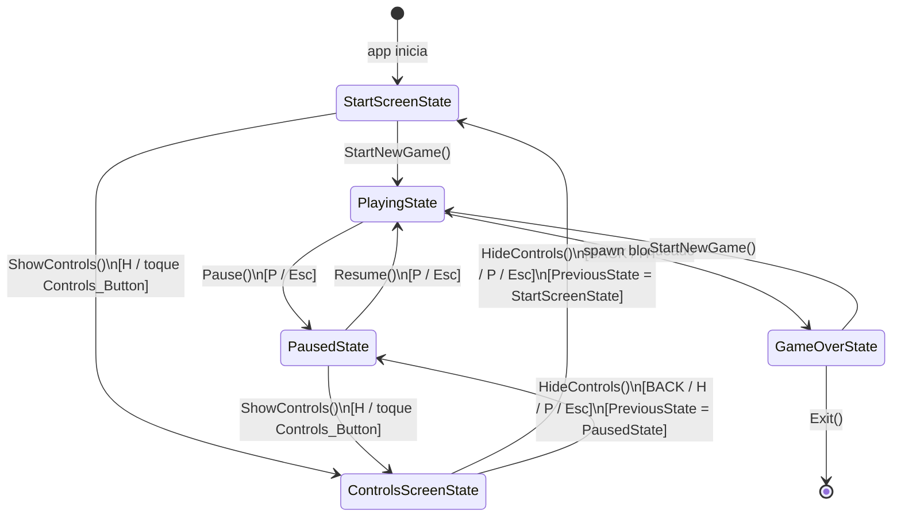
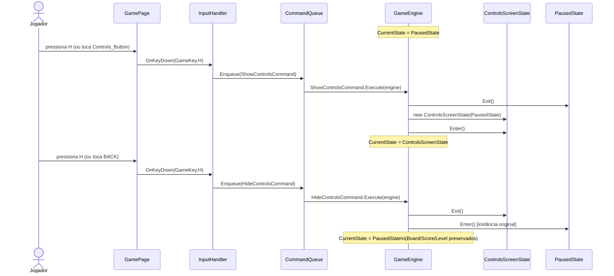
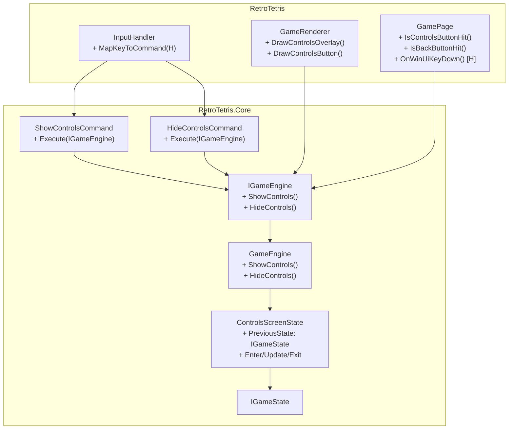

# Design Técnico — Tela de Controles (game-controls-screen)

## Visão Geral

Esta feature adiciona uma tela de controles ao RetroTetris, acessível a partir da tela inicial e da tela de pausa. A implementação segue os padrões arquiteturais já estabelecidos no projeto: State Machine para controle de fluxo, Command Pattern para entrada do usuário, e renderização via `IDrawable` no `GameRenderer`.

A abordagem central é a criação de um novo estado `ControlsScreenState` que armazena o estado anterior (`PreviousState`), garantindo que o jogador possa consultar os controles e retornar exatamente ao ponto onde estava — sem perder progresso de partida.

### Decisões de Design

- **Novo estado vs. flag booleana**: Optou-se por um estado dedicado (`ControlsScreenState`) em vez de uma flag `isShowingControls` no `GameEngine`. Isso mantém a consistência com a State Machine existente e evita lógica condicional espalhada.
- **PreviousState como referência de instância**: O `ControlsScreenState` armazena a instância exata do estado anterior (não uma cópia), garantindo que o retorno seja ao mesmo objeto — o que é seguro porque `PausedState` e `StartScreenState` são stateless.
- **Dois comandos separados vs. toggle**: `ShowControlsCommand` e `HideControlsCommand` são preferíveis a um `ToggleControlsCommand` porque tornam a intenção explícita e evitam ambiguidade sobre o estado atual.
- **Hit-testing inline**: As posições do `Controls_Button` e do botão `BACK` são calculadas inline no `GameRenderer` e replicadas no `GamePage`, seguindo o padrão já estabelecido pelos botões `Start`, `Try Again` e `Exit`.

---

## Arquitetura

### Diagrama de Fluxo de Estados



### Diagrama de Sequência — Abrir e Fechar Controls (a partir do Pause)



### Visão Geral dos Componentes Afetados



---

## Componentes e Interfaces

### 1. `ControlsScreenState` (novo — `RetroTetris.Core/States/`)

```csharp
namespace RetroTetris.Core.States;

/// <summary>
/// Estado que representa a Controls_Screen ativa.
/// Suspende o game loop e armazena o estado anterior para retorno exato.
/// </summary>
public class ControlsScreenState : IGameState
{
    /// <summary>
    /// Estado imediatamente anterior à abertura da Controls_Screen.
    /// Sempre StartScreenState ou PausedState — nunca outro ControlsScreenState.
    /// </summary>
    public IGameState PreviousState { get; }

    public ControlsScreenState(IGameState previousState)
    {
        // Invariante: previousState nunca pode ser ControlsScreenState
        if (previousState is ControlsScreenState)
            throw new ArgumentException(
                "ControlsScreenState não pode ser aninhado.", nameof(previousState));

        PreviousState = previousState;
    }

    public void Enter(IGameEngine engine) { }

    /// <summary>
    /// Update é no-op: o game loop permanece suspenso enquanto a Controls_Screen está ativa.
    /// </summary>
    public void Update(IGameEngine engine, TimeSpan delta) { }

    public void Exit(IGameEngine engine) { }
}
```

**Invariante crítica**: O construtor rejeita `ControlsScreenState` como `previousState`, impedindo aninhamento. Isso é verificado em tempo de execução e coberto pela Propriedade 6.

---

### 2. `ShowControlsCommand` (novo — `RetroTetris.Core/Commands/`)

```csharp
namespace RetroTetris.Core.Commands;

/// <summary>
/// Abre a Controls_Screen a partir de StartScreenState ou PausedState.
/// No-op em qualquer outro estado.
/// </summary>
public sealed class ShowControlsCommand : IGameCommand
{
    public void Execute(IGameEngine engine)
    {
        if (engine.CurrentState is StartScreenState or PausedState)
            engine.ShowControls();
    }
}
```

---

### 3. `HideControlsCommand` (novo — `RetroTetris.Core/Commands/`)

```csharp
namespace RetroTetris.Core.Commands;

/// <summary>
/// Fecha a Controls_Screen e retorna ao PreviousState armazenado.
/// No-op se não estiver em ControlsScreenState.
/// </summary>
public sealed class HideControlsCommand : IGameCommand
{
    public void Execute(IGameEngine engine)
    {
        if (engine.CurrentState is ControlsScreenState)
            engine.HideControls();
    }
}
```

---

### 4. `IGameEngine` — Adições à interface

```csharp
// Adicionar ao IGameEngine existente:

/// <summary>
/// Abre a Controls_Screen. Válido apenas em StartScreenState ou PausedState.
/// </summary>
void ShowControls();

/// <summary>
/// Fecha a Controls_Screen e retorna ao PreviousState. Válido apenas em ControlsScreenState.
/// </summary>
void HideControls();
```

---

### 5. `GameEngine` — Implementação dos novos métodos

```csharp
/// <summary>
/// Abre a Controls_Screen. Só válido em StartScreenState ou PausedState.
/// </summary>
public void ShowControls()
{
    if (_currentState is StartScreenState or PausedState)
        TransitionTo(new ControlsScreenState(_currentState));
}

/// <summary>
/// Fecha a Controls_Screen e retorna ao PreviousState armazenado.
/// </summary>
public void HideControls()
{
    if (_currentState is ControlsScreenState css)
        TransitionTo(css.PreviousState);
}
```

**Nota sobre `Update()`**: O método `Update()` existente já é no-op para qualquer estado que não seja `PlayingState`. `ControlsScreenState` se beneficia disso automaticamente — nenhuma alteração necessária no `Update()`.

---

### 6. `InputHandler` — Mapeamento da tecla H

```csharp
// Adicionar ao switch em MapKeyToCommand():
GameKey.H => new ShowControlsCommand(),
```

**Tratamento de H durante ControlsScreenState**: `ShowControlsCommand.Execute()` verifica o estado atual. Quando em `ControlsScreenState`, a condição `is StartScreenState or PausedState` é falsa, então o comando é no-op. Para fechar com H, é necessário mapear H também para `HideControlsCommand` — ou usar um `ToggleControlsCommand` que detecta o estado atual.

**Solução recomendada — `ToggleControlsCommand`** (alternativa mais limpa para a tecla H):

```csharp
public sealed class ToggleControlsCommand : IGameCommand
{
    public void Execute(IGameEngine engine)
    {
        if (engine.CurrentState is ControlsScreenState)
            engine.HideControls();
        else if (engine.CurrentState is StartScreenState or PausedState)
            engine.ShowControls();
    }
}
```

Mapear `GameKey.H => new ToggleControlsCommand()` no `InputHandler`.

Para Escape e P durante `ControlsScreenState`, o `TogglePauseCommand` existente não trata esse estado. Adicionar ao `TogglePauseCommand`:

```csharp
public void Execute(IGameEngine e)
{
    if (e.CurrentState is PlayingState)
        e.Pause();
    else if (e.CurrentState is PausedState)
        e.Resume();
    else if (e.CurrentState is ControlsScreenState)  // NOVO
        e.HideControls();
}
```

---

### 7. `GamePage` — Adições ao hit-testing e teclado

#### Mapeamento de VirtualKey.H (Windows)

```csharp
// Adicionar ao switch em MapVirtualKey():
VirtualKey.H => GameKey.H,
```

#### Novos métodos de hit-testing

```csharp
private bool IsControlsButtonHit(float x, float y)
{
    float w = (float)GameCanvas.Width;
    float h = (float)GameCanvas.Height;
    float btnW = w * 0.3f;
    float btnH = h * 0.08f;
    float btnX = (w - btnW) / 2f;
    float btnY = h * 0.68f;  // abaixo do Start (0.58f)
    return x >= btnX && x <= btnX + btnW && y >= btnY && y <= btnY + btnH;
}

private bool IsControlsButtonHitOnPause(float x, float y)
{
    var r = _layout.BoardRect;
    float btnW = r.Width * 0.7f;
    float btnH = Math.Max(20, r.Height * 0.09f);
    float centerY = r.Y + r.Height * 0.62f;  // abaixo de "PAUSED"
    float btnX = r.X + (r.Width - btnW) / 2f;
    float btnY = centerY - btnH / 2f;
    return x >= btnX && x <= btnX + btnW && y >= btnY && y <= btnY + btnH;
}

private bool IsBackButtonHit(float x, float y)
{
    var r = _layout.BoardRect;
    float btnW = r.Width * 0.5f;
    float btnH = Math.Max(20, r.Height * 0.09f);
    float centerY = r.Y + r.Height * 0.88f;  // rodapé da Controls_Screen
    float btnX = r.X + (r.Width - btnW) / 2f;
    float btnY = centerY - btnH / 2f;
    return x >= btnX && x <= btnX + btnW && y >= btnY && y <= btnY + btnH;
}
```

#### Atualização do `OnTapped()`

```csharp
private void OnTapped(object? sender, TappedEventArgs e)
{
    var pos = e.GetPosition(GameCanvas);
    if (pos is null) return;

    float tapX = (float)pos.Value.X;
    float tapY = (float)pos.Value.Y;

    var state = _engine.CurrentState;

    // ── Controls Screen: BACK button ────────────────────────────────────
    if (state is ControlsScreenState)
    {
        if (IsBackButtonHit(tapX, tapY))
            _engine.HideControls();
        return;
    }

    // ── Start screen ────────────────────────────────────────────────────
    if (state is StartScreenState)
    {
        if (IsStartButtonHit(tapX, tapY))
            _engine.StartNewGame();
        else if (IsControlsButtonHit(tapX, tapY))
            _engine.ShowControls();
        return;
    }

    // ── Paused: Controls button ──────────────────────────────────────────
    if (state is PausedState)
    {
        if (IsControlsButtonHitOnPause(tapX, tapY))
            _engine.ShowControls();
        return;
    }

    // ── Game over ────────────────────────────────────────────────────────
    if (state is GameOverState)
    {
        if (IsTryAgainButtonHit(tapX, tapY))
            _engine.StartNewGame();
        else if (IsExitButtonHit(tapX, tapY))
            Application.Current?.Quit();
        return;
    }

    // ── Playing: tap left/right to rotate ───────────────────────────────
    if (state is PlayingState)
    {
        var side = tapX < GameCanvas.Width / 2 ? TapSide.Left : TapSide.Right;
        _inputHandler.OnTap(side);
    }
}
```

---

### 8. `GameRenderer` — Novos métodos de renderização

#### Atualização do `Draw()`

```csharp
public void Draw(ICanvas canvas, RectF dirtyRect)
{
    if (_engine is null) return;
    _layout.Update(dirtyRect.Width, dirtyRect.Height);

    canvas.FillColor = Background;
    canvas.FillRectangle(dirtyRect);

    var state = _engine.CurrentState;

    if (state is StartScreenState)
    {
        DrawStartScreen(canvas, dirtyRect);
        return;
    }

    // ControlsScreenState com PreviousState = StartScreenState
    if (state is ControlsScreenState { PreviousState: StartScreenState })
    {
        DrawStartScreen(canvas, dirtyRect);
        DrawControlsOverlay(canvas, dirtyRect);
        return;
    }

    // Renderização normal do jogo
    DrawBoardBackground(canvas);
    DrawBoardCells(canvas);
    DrawGhostPiece(canvas);
    DrawActivePiece(canvas);
    DrawFlashingLines(canvas);
    DrawBoardBorder(canvas);
    DrawHoldPanel(canvas);
    DrawNextPanel(canvas);
    DrawScorePanel(canvas);
    DrawLevelPanel(canvas);

    if (state is PausedState)
        DrawPauseOverlay(canvas, dirtyRect);
    else if (state is GameOverState)
        DrawGameOverOverlay(canvas, dirtyRect);
    else if (state is ControlsScreenState { PreviousState: PausedState })
    {
        DrawPauseOverlay(canvas, dirtyRect);
        DrawControlsOverlay(canvas, dirtyRect);
    }
}
```

#### `DrawControlsButton()` — Botão na Start Screen e Pause Overlay

```csharp
// Chamado dentro de DrawStartScreen() após o botão Start:
private void DrawControlsButton(ICanvas canvas, RectF bounds)
{
    float btnW = bounds.Width * 0.3f;
    float btnH = bounds.Height * 0.08f;
    float btnX = (bounds.Width - btnW) / 2f;
    float btnY = bounds.Height * 0.68f;

    canvas.FillColor = ButtonBg;
    canvas.FillRectangle(btnX, btnY, btnW, btnH);
    canvas.StrokeColor = Color.FromArgb("#888888");
    canvas.StrokeSize = 2;
    canvas.DrawRectangle(btnX, btnY, btnW, btnH);

    canvas.FontColor = Color.FromArgb("#888888");
    canvas.FontSize = Math.Max(8, bounds.Width * 0.022f);
    canvas.Font = new MauiFont(PixelFont);
    canvas.DrawString("CONTROLS", btnX + btnW / 2f, btnY + btnH / 2f,
        HorizontalAlignment.Center);
}

// Chamado dentro de DrawPauseOverlay() após "PRESS P TO RESUME":
private void DrawControlsButtonOnPause(ICanvas canvas, RectF boardRect)
{
    var r = boardRect;
    float btnW = r.Width * 0.7f;
    float btnH = Math.Max(20, r.Height * 0.09f);
    float centerY = r.Y + r.Height * 0.62f;
    float btnX = r.X + (r.Width - btnW) / 2f;
    float btnY = centerY - btnH / 2f;

    canvas.FillColor = ButtonBg;
    canvas.FillRectangle(btnX, btnY, btnW, btnH);
    canvas.StrokeColor = Color.FromArgb("#888888");
    canvas.StrokeSize = 1.5f;
    canvas.DrawRectangle(btnX, btnY, btnW, btnH);

    canvas.FontColor = Color.FromArgb("#888888");
    canvas.FontSize = Math.Max(6, r.Width * 0.045f);
    canvas.Font = new MauiFont(PixelFont);
    canvas.DrawString("CONTROLS", btnX + btnW / 2f, centerY,
        HorizontalAlignment.Center);
}
```

#### `DrawControlsOverlay()` — Tela principal de controles

```csharp
private void DrawControlsOverlay(ICanvas canvas, RectF bounds)
{
    var r = _layout.BoardRect;

    // Fundo semitransparente (consistente com PauseOverlay e GameOverOverlay)
    canvas.FillColor = OverlayBg;  // #CC000000
    canvas.FillRectangle(r);

    // Borda decorativa retrô (dupla borda, estilo ciano)
    canvas.StrokeColor = Color.FromArgb("#00F0F0");
    canvas.StrokeSize = 2;
    canvas.DrawRectangle(r.X + 4, r.Y + 4, r.Width - 8, r.Height - 8);
    canvas.StrokeColor = Color.FromArgb("#444444");
    canvas.StrokeSize = 1;
    canvas.DrawRectangle(r.X + 7, r.Y + 7, r.Width - 14, r.Height - 14);

    // Título
    canvas.FontColor = Color.FromArgb("#00F0F0");
    canvas.FontSize = Math.Max(10, r.Width * 0.08f);
    canvas.Font = new MauiFont(PixelFont);
    canvas.DrawString("CONTROLS", r.X + r.Width / 2f, r.Y + r.Height * 0.08f,
        HorizontalAlignment.Center);

    // Separador
    canvas.StrokeColor = Color.FromArgb("#444444");
    canvas.StrokeSize = 1;
    canvas.DrawLine(r.X + 12, r.Y + r.Height * 0.13f,
                    r.X + r.Width - 12, r.Y + r.Height * 0.13f);

    // Lista de controles de teclado
    DrawCommandEntries(canvas, r, _keyboardEntries, r.Y + r.Height * 0.16f);

    // Separador entre teclado e toque
    float touchSectionY = r.Y + r.Height * 0.16f + _keyboardEntries.Length * r.Height * 0.072f + 4;
    canvas.StrokeColor = Color.FromArgb("#333333");
    canvas.StrokeSize = 1;
    canvas.DrawLine(r.X + 12, touchSectionY, r.X + r.Width - 12, touchSectionY);

    // Subtítulo Touch
    canvas.FontColor = Color.FromArgb("#666666");
    canvas.FontSize = Math.Max(5, r.Width * 0.04f);
    canvas.Font = new MauiFont(PixelFont);
    canvas.DrawString("TOUCH", r.X + r.Width / 2f, touchSectionY + 10,
        HorizontalAlignment.Center);

    // Lista de controles de toque
    DrawCommandEntries(canvas, r, _touchEntries, touchSectionY + 18);

    // Botão BACK
    DrawBackButton(canvas, r);
}

private void DrawCommandEntries(ICanvas canvas, RectF boardRect,
    (string key, string action)[] entries, float startY)
{
    float rowH = boardRect.Height * 0.072f;
    float fontSize = Math.Max(5, boardRect.Width * 0.038f);
    float leftX  = boardRect.X + boardRect.Width * 0.08f;
    float rightX = boardRect.X + boardRect.Width * 0.92f;

    canvas.Font = new MauiFont(PixelFont);

    for (int i = 0; i < entries.Length; i++)
    {
        float y = startY + i * rowH;

        // Rótulo da tecla (alinhado à esquerda, ciano)
        canvas.FontColor = Color.FromArgb("#00F0F0");
        canvas.FontSize = fontSize;
        canvas.DrawString(entries[i].key, leftX, y, HorizontalAlignment.Left);

        // Descrição da ação (alinhada à direita, texto claro)
        canvas.FontColor = TextColor;  // #EEEEEE
        canvas.FontSize = fontSize;
        canvas.DrawString(entries[i].action, rightX, y, HorizontalAlignment.Right);
    }
}

private void DrawBackButton(ICanvas canvas, RectF boardRect)
{
    float btnW = boardRect.Width * 0.5f;
    float btnH = Math.Max(20, boardRect.Height * 0.09f);
    float centerY = boardRect.Y + boardRect.Height * 0.88f;
    float btnX = boardRect.X + (boardRect.Width - btnW) / 2f;
    float btnY = centerY - btnH / 2f;

    canvas.FillColor = ButtonBg;
    canvas.FillRectangle(btnX, btnY, btnW, btnH);
    canvas.StrokeColor = Color.FromArgb("#888888");
    canvas.StrokeSize = 1.5f;
    canvas.DrawRectangle(btnX, btnY, btnW, btnH);

    canvas.FontColor = Color.FromArgb("#888888");
    canvas.FontSize = Math.Max(6, boardRect.Width * 0.045f);
    canvas.Font = new MauiFont(PixelFont);
    canvas.DrawString("BACK", btnX + btnW / 2f, centerY, HorizontalAlignment.Center);
}
```

---

## Modelos de Dados

### `ControlsScreenState`

| Campo | Tipo | Descrição |
|---|---|---|
| `PreviousState` | `IGameState` | Estado anterior (StartScreenState ou PausedState). Imutável após construção. |

**Invariante**: `PreviousState is not ControlsScreenState` — verificada no construtor.

### Listas de Command Entries (constantes no `GameRenderer`)

```csharp
private static readonly (string key, string action)[] _keyboardEntries =
{
    ("←",        "MOVER ESQUERDA"),
    ("→",        "MOVER DIREITA"),
    ("↓",        "SOFT DROP"),
    ("ESPAÇO",   "HARD DROP"),
    ("↑ / Z",    "ROTAR HORÁRIO"),
    ("X",        "ROTAR ANTI-HOR."),
    ("C / SHIFT","HOLD"),
    ("P / ESC",  "PAUSAR/RETOMAR"),
    ("H",        "CONTROLES"),
};

private static readonly (string key, string action)[] _touchEntries =
{
    ("SWIPE ←",  "MOVER ESQUERDA"),
    ("SWIPE →",  "MOVER DIREITA"),
    ("SWIPE ↓",  "SOFT DROP"),
    ("SWIPE ↑",  "HARD DROP"),
    ("TAP ←",    "ROTAR ANTI-HOR."),
    ("TAP →",    "ROTAR HORÁRIO"),
};
```

### Enum `GameKey` — Adição

```csharp
// Adicionar ao enum GameKey existente:
H,
```

### Paleta de Cores (sem alterações — reutiliza as existentes)

| Constante | Hex | Uso |
|---|---|---|
| `OverlayBg` | `#CC000000` | Fundo semitransparente da Controls_Screen |
| `TextColor` | `#EEEEEE` | Descrições das ações |
| `#00F0F0` (ciano) | `#00F0F0` | Título, rótulos de teclas, borda decorativa |
| `ButtonBg` | `#222222` | Fundo do botão BACK e Controls_Button |
| `#888888` | `#888888` | Borda e texto do botão BACK e Controls_Button |
| `PixelFont` | `"PressStart2P"` | Toda a tipografia da Controls_Screen |

---

## Propriedades de Correção

*Uma propriedade é uma característica ou comportamento que deve ser verdadeiro em todas as execuções válidas de um sistema — essencialmente, uma declaração formal sobre o que o sistema deve fazer. Propriedades servem como ponte entre especificações legíveis por humanos e garantias de correção verificáveis por máquina.*

### Propriedade 1: Transição para ControlsScreenState preserva o PreviousState correto

*Para qualquer* estado válido de origem (StartScreenState ou PausedState), chamar `ShowControls()` deve resultar em `CurrentState` sendo um `ControlsScreenState` cujo `PreviousState` é exatamente a instância do estado de origem.

**Validates: Requirements 1.3, 2.3**

---

### Propriedade 2: Fechamento retorna exatamente ao PreviousState

*Para qualquer* `ControlsScreenState` com `PreviousState` válido (StartScreenState ou PausedState), chamar `HideControls()` deve resultar em `CurrentState == PreviousState` (mesma instância armazenada no `ControlsScreenState`).

**Validates: Requirements 4.1, 4.2**

---

### Propriedade 3: Preservação completa do estado de jogo ao abrir e fechar Controls

*Para qualquer* estado de jogo válido (qualquer combinação de `Board`, `Score`, `Level`, `HoldPiece`, `BagRandomizer`), a sequência `ShowControls()` seguida de `HideControls()` deve preservar todos esses valores identicamente — nenhum campo deve ser alterado.

**Validates: Requirements 4.3, 4.5**

---

### Propriedade 4: Game loop suspenso durante ControlsScreenState

*Para qualquer* `ControlsScreenState` (independentemente do `PreviousState`), chamar `Update(delta)` N vezes não deve alterar `Board`, `Score`, `Level`, `ActivePiece`, `HoldPiece` ou o estado interno do `BagRandomizer`.

**Validates: Requirements 4.5**

---

### Propriedade 5: ShowControls() é no-op em estados inválidos

*Para qualquer* estado que não seja `StartScreenState` nem `PausedState` (incluindo `PlayingState`, `GameOverState` e `ControlsScreenState`), chamar `ShowControls()` não deve alterar `CurrentState`.

**Validates: Requirements 1.3, 2.3** (por contraposição — define o domínio válido)

---

### Propriedade 6: Sem aninhamento de ControlsScreenState

*Para qualquer* `ControlsScreenState`, seu `PreviousState` nunca pode ser outro `ControlsScreenState`. Tentar construir `new ControlsScreenState(controlsScreenState)` deve lançar exceção. Adicionalmente, chamar `ShowControls()` quando já em `ControlsScreenState` deve ser no-op (coberto pela Propriedade 5).

**Validates: Requirements 4.3** (garante que o retorno é sempre para um estado de jogo real)

---

### Propriedade 7: Layout de Command_Entry — rótulo sempre à esquerda da descrição

*Para qualquer* `Command_Entry` renderizado na Controls_Screen, a coordenada X do rótulo da tecla deve ser estritamente menor que a coordenada X da descrição da ação.

**Validates: Requirements 3.5**

---

## Tratamento de Erros

### Tentativa de aninhamento de ControlsScreenState

**Situação**: `ShowControls()` chamado quando `CurrentState` já é `ControlsScreenState`.

**Tratamento**: `ShowControls()` verifica `_currentState is StartScreenState or PausedState` — a condição é falsa para `ControlsScreenState`, tornando a operação no-op. O construtor de `ControlsScreenState` também lança `ArgumentException` como segunda linha de defesa.

**Resultado**: Nenhuma transição ocorre. Estado permanece inalterado.

---

### `HideControls()` chamado fora de ControlsScreenState

**Situação**: `HideControls()` chamado quando `CurrentState` não é `ControlsScreenState`.

**Tratamento**: `HideControls()` verifica `_currentState is ControlsScreenState css` — a condição é falsa, tornando a operação no-op.

**Resultado**: Nenhuma transição ocorre. Estado permanece inalterado.

---

### Tecla H durante PlayingState

**Situação**: Jogador pressiona H enquanto está jogando (não pausado).

**Tratamento**: `ToggleControlsCommand.Execute()` verifica o estado atual. `PlayingState` não satisfaz nenhuma condição, então o comando é no-op.

**Resultado**: Nenhuma ação. O jogo continua normalmente.

---

### Toque fora dos botões durante ControlsScreenState

**Situação**: Jogador toca em área que não é o botão BACK.

**Tratamento**: `OnTapped()` verifica `IsBackButtonHit()` — se falso, retorna sem ação.

**Resultado**: Nenhuma transição. A Controls_Screen permanece visível.

---

## Estratégia de Testes

### Abordagem Dual

A estratégia combina testes de exemplo (para comportamentos específicos e casos de borda) com testes baseados em propriedades (para invariantes universais). Os testes de propriedade são implementados com a biblioteca **CsCheck** (property-based testing para .NET).

**Biblioteca PBT**: [CsCheck](https://github.com/AnthonyLloyd/CsCheck) — escolhida por ser nativa para .NET/C#, sem dependências externas, e por suportar geradores customizados de forma idiomática.

**Configuração mínima**: 100 iterações por propriedade (padrão do CsCheck).

---

### Testes de Exemplo (RetroTetris.Core.Tests)

| Teste | Requisito |
|---|---|
| `ShowControls_FromStartScreen_TransitionsToControlsScreenState` | 1.3 |
| `ShowControls_FromPausedState_TransitionsToControlsScreenState` | 2.3 |
| `HideControls_FromControlsScreen_ReturnsToStartScreen` | 4.4 |
| `HideControls_FromControlsScreen_ReturnsToPausedState` | 4.1 |
| `KeyH_InStartScreen_OpensControls` | 1.4 |
| `KeyH_InPausedState_OpensControls` | 2.4 |
| `KeyEscape_InControlsScreen_ClosesControls` | 4.2 |
| `KeyP_InControlsScreen_ClosesControls` | 4.2 |
| `KeyH_InControlsScreen_ClosesControls` | 4.2 |
| `ShowControls_InPlayingState_IsNoOp` | 1.3 (contraposição) |
| `ShowControls_InGameOverState_IsNoOp` | 1.3 (contraposição) |
| `ControlsScreenState_Constructor_RejectsNestedControlsScreenState` | 4.3 |
| `Renderer_DrawsControlsButton_InStartScreen` | 1.1 |
| `Renderer_DrawsControlsButton_InPausedState` | 2.1 |
| `Renderer_DrawsAllKeyboardEntries_InControlsScreen` | 3.3 |
| `Renderer_DrawsAllTouchEntries_InControlsScreen` | 3.4 |
| `Renderer_DrawsBackButton_InControlsScreen` | 3.6 |
| `Renderer_UsesPressStart2PFont_InControlsScreen` | 5.2 |

---

### Testes de Propriedade (CsCheck)

Cada teste de propriedade deve ser anotado com o comentário de rastreabilidade:

```
// Feature: game-controls-screen, Property N: <texto da propriedade>
```

#### Propriedade 1 — Transição preserva PreviousState correto

```csharp
// Feature: game-controls-screen, Property 1: ShowControls() preserva PreviousState correto
[Fact]
public void Property1_ShowControls_PreservesPreviousState()
{
    // Gera: StartScreenState ou PausedState aleatoriamente
    Gen.OneOf(
        Gen.Const<IGameState>(new StartScreenState()),
        Gen.Const<IGameState>(new PausedState())
    ).Sample(originState =>
    {
        var engine = CreateEngineInState(originState);
        engine.ShowControls();

        Assert.IsType<ControlsScreenState>(engine.CurrentState);
        var css = (ControlsScreenState)engine.CurrentState;
        Assert.Same(originState, css.PreviousState);
    });
}
```

#### Propriedade 2 — Fechamento retorna ao PreviousState

```csharp
// Feature: game-controls-screen, Property 2: HideControls() retorna exatamente ao PreviousState
[Fact]
public void Property2_HideControls_ReturnsExactlyToPreviousState()
{
    Gen.OneOf(
        Gen.Const<IGameState>(new StartScreenState()),
        Gen.Const<IGameState>(new PausedState())
    ).Sample(previousState =>
    {
        var engine = CreateEngineInState(new ControlsScreenState(previousState));
        engine.HideControls();

        Assert.Same(previousState, engine.CurrentState);
    });
}
```

#### Propriedade 3 — Preservação completa do estado de jogo

```csharp
// Feature: game-controls-screen, Property 3: ShowControls+HideControls preserva estado de jogo
[Fact]
public void Property3_OpenCloseControls_PreservesGameState()
{
    // Gera estado de jogo aleatório (board preenchido, score, level, hold piece)
    GenGameState().Sample(gameState =>
    {
        var engine = CreateEngineWithGameState(gameState);
        var snapshot = CaptureSnapshot(engine);

        engine.ShowControls();   // abre
        engine.HideControls();   // fecha

        AssertSnapshotEqual(snapshot, engine);
    });
}
```

#### Propriedade 4 — Game loop suspenso

```csharp
// Feature: game-controls-screen, Property 4: Update() é no-op em ControlsScreenState
[Fact]
public void Property4_Update_IsNoOp_InControlsScreenState()
{
    Gen.Select(
        GenGameState(),
        Gen.Int[1, 100],                    // N iterações de Update
        Gen.TimeSpan[1ms, 500ms]            // delta aleatório
    ).Sample((gameState, iterations, delta) =>
    {
        var engine = CreateEngineWithGameState(gameState);
        engine.Pause();
        engine.ShowControls();

        var snapshot = CaptureSnapshot(engine);

        for (int i = 0; i < iterations; i++)
            engine.Update(delta);

        AssertSnapshotEqual(snapshot, engine);
    });
}
```

#### Propriedade 5 — ShowControls() é no-op em estados inválidos

```csharp
// Feature: game-controls-screen, Property 5: ShowControls() é no-op em estados inválidos
[Fact]
public void Property5_ShowControls_IsNoOp_InInvalidStates()
{
    // Gera: PlayingState ou GameOverState (estados onde ShowControls não deve agir)
    Gen.OneOf(
        Gen.Const<IGameState>(new PlayingState()),
        Gen.Const<IGameState>(new GameOverState())
    ).Sample(invalidState =>
    {
        var engine = CreateEngineInState(invalidState);
        var stateBefore = engine.CurrentState;

        engine.ShowControls();

        Assert.Same(stateBefore, engine.CurrentState);
    });
}
```

#### Propriedade 6 — Sem aninhamento de ControlsScreenState

```csharp
// Feature: game-controls-screen, Property 6: ControlsScreenState não pode ser aninhado
[Fact]
public void Property6_ControlsScreenState_CannotBeNested()
{
    Gen.OneOf(
        Gen.Const<IGameState>(new StartScreenState()),
        Gen.Const<IGameState>(new PausedState())
    ).Sample(validPrevious =>
    {
        var outerCss = new ControlsScreenState(validPrevious);

        // Construtor deve lançar exceção ao tentar aninhar
        Assert.Throws<ArgumentException>(() =>
            new ControlsScreenState(outerCss));

        // ShowControls() em ControlsScreenState deve ser no-op
        var engine = CreateEngineInState(outerCss);
        engine.ShowControls();
        Assert.Same(outerCss, engine.CurrentState);
    });
}
```

#### Propriedade 7 — Layout de Command_Entry

```csharp
// Feature: game-controls-screen, Property 7: rótulo sempre à esquerda da descrição
[Fact]
public void Property7_CommandEntry_KeyLabelLeftOfDescription()
{
    // Gera dimensões de canvas aleatórias (simula diferentes tamanhos de tela)
    Gen.Select(Gen.Float[200f, 800f], Gen.Float[400f, 1200f])
    .Sample((width, height) =>
    {
        var entries = GetRenderedEntryPositions(width, height);
        foreach (var (keyX, actionX) in entries)
            Assert.True(keyX < actionX,
                $"Rótulo (x={keyX}) deve estar à esquerda da descrição (x={actionX})");
    });
}
```
