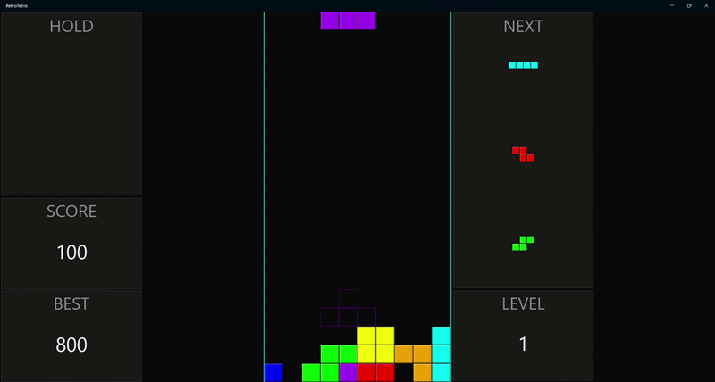

# RetroTetris

Uma implementação fiel do jogo clássico Tetris como aplicação desktop nativa, construída com **.NET 10** e **.NET MAUI**. O jogo é executado em janela nativa do Windows e reproduz a experiência original do Tetris, incluindo os 7 tetrominós padrão, mecânicas de rotação SRS, eliminação de linhas e sistema de pontuação — com visual em estilo retrô inspirado nos clássicos dos anos 80/90.

> 🇺🇸 [Read in English](README.md)

---

## Demo



---

## Funcionalidades

- 🎮 Os 7 tetrominós padrão (I, O, T, S, Z, J, L) com cores retrô distintas
- 👻 Ghost piece indicando onde a peça ativa vai pousar
- 🔄 SRS (Super Rotation System) com tabelas de wall-kick do Tetris Guideline
- 🎒 Randomizador 7-bag garantindo distribuição uniforme de peças
- ⏱️ Lock delay com até 15 reinicializações por peça
- 🔒 Mecânica de hold piece (uma troca por peça ativa)
- 📋 Painel de prévia das próximas 3 peças
- 📈 Pontuação, nível e recorde pessoal com persistência local
- ⏸️ Suporte a pausa e retomada
- 📖 Tela de controles acessível pela tela inicial e pelo overlay de pausa
- 🔊 Efeitos sonoros retrô e trilha sonora via Plugin.Maui.Audio
- 📐 Layout responsivo que se adapta ao tamanho da janela (retrato e paisagem)
- ⌨️ Controles por teclado com DAS/ARR (Delayed Auto Shift / Auto Repeat Rate)

---

## Controles

| Tecla | Ação |
|---|---|
| ← → | Mover esquerda / direita |
| ↓ | Soft drop |
| Espaço | Hard drop |
| ↑ ou Z | Rotacionar no sentido horário |
| X | Rotacionar no sentido anti-horário |
| C ou Shift | Hold piece |
| Escape ou P | Pausar / Retomar |
| H | Tela de controles |

---

## Arquitetura

O projeto é dividido em **3 projetos separados** para garantir separação de camadas no nível do compilador:

```
RetroTetris.slnx
├── RetroTetris.Core/     ← Lógica pura do jogo — sem dependências MAUI
├── RetroTetris/          ← App MAUI — renderização, input, serviços
└── RetroTetris.Tests/    ← xUnit + FsCheck — testes unitários e de propriedade
```

### Padrões de Design Aplicados

| Padrão | Onde | Propósito |
|---|---|---|
| **State Machine** | `GameEngine` + `IGameState` | Gerencia estados do jogo (StartScreen, Playing, Paused, ControlsScreen, GameOver) sem if/switch espalhados |
| **Command** | `IGameCommand` + `CommandQueue` | Desacopla input da lógica do jogo; permite passagem de comandos thread-safe |
| **Observer** | Eventos C# no `GameEngine` | Desacopla o engine de áudio, pontuação e atualizações de UI |
| **Game Loop** | `GameLoop` (thread dedicada) | Delta time real via `Stopwatch`; fases explícitas ProcessInput → Update → Render |

### Stack Tecnológica

| Componente | Tecnologia |
|---|---|
| Framework | .NET 10 + .NET MAUI |
| Renderização | `GraphicsView` / `ICanvas` (MAUI nativo) |
| Áudio | Plugin.Maui.Audio |
| Persistência | `FileSystem.AppDataDirectory` + `System.Text.Json` |
| Testes | xUnit + FsCheck (property-based testing) |
| Plataforma | Windows (WinUI 3) |

---

## Como Executar

### Pré-requisitos

- [.NET 10 SDK](https://dotnet.microsoft.com/download)
- Visual Studio 2026 com as seguintes cargas de trabalho:
  - **"Desenvolvimento de .NET Multi-Platform App UI"**
  - **"Desenvolvimento para Desktop com C++"** *(necessário para componentes nativos do WinUI 3)*

### Build e Execução

```bash
# Build
dotnet build RetroTetris/RetroTetris.csproj

# Executar
dotnet run --project RetroTetris/RetroTetris.csproj -f net10.0-windows10.0.19041.0
```

### Executar Testes

```bash
dotnet test RetroTetris.Tests/RetroTetris.Tests.csproj
```

---

## Estrutura do Projeto

```
RetroTetris.Core/
├── Engine/          ← GameEngine, Board, Tetromino, BagRandomizer, SRS, etc.
├── Commands/        ← Implementações de IGameCommand (Command Pattern)
├── States/          ← Implementações de IGameState (State Machine Pattern)
├── Interfaces/      ← IGameEngine, IAudioService, IGameRenderer, etc.
└── Models/          ← GameSnapshot, HighScoreData

RetroTetris/
├── Pages/           ← GamePage (MAUI XAML)
├── Presentation/    ← GameRenderer, InputHandler, LayoutManager
└── Services/        ← AudioService, HighScoreRepository
```

---

## Propriedades de Correção (Property-Based Testing)

A lógica do jogo é validada por 10 propriedades formais de correção usando FsCheck:

1. **Movimento lateral** respeita os limites do board e células ocupadas
2. **Rotação SRS** sempre produz uma posição válida no board
3. **Hard drop** posiciona a peça na linha mais baixa possível
4. **Ghost piece** sempre coincide com o destino do hard drop
5. **Eliminação de linhas** preserva todas as células de linhas incompletas
6. **Pontuação** segue a fórmula exata: `multiplicador[n] × nível`
7. **Bag randomizer** garante que cada um dos 7 tipos aparece exatamente uma vez por ciclo
8. **Intervalo de queda** segue `max(100, 1000 - (nível - 1) × 90)` ms
9. **Hold** é bloqueado após uso até a peça atual ser fixada
10. **Nível** incrementa a cada 10 linhas: `min(15, 1 + floor(linhas / 10))`

---

## Licença

Este projeto é destinado a fins de estudo e portfólio.
